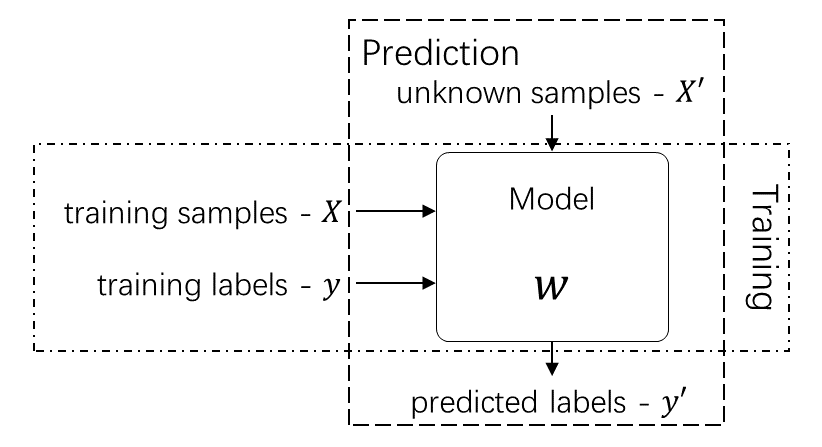

# "A" Review of MLPR (2018)

### PREFACE
All the following contents are my personal opinions and I know for sure that some
content are still confusing/improper. So, I would really 
appreciate that if you could share your knowledge and give any comment on these 
topics by Hypothesis. And, of course, you would be always welcome if you want to
write down something on any topic.

Thanks to Iain for reviewing the draft version of outline.

> I know that the latex is not working on this page. 
  I'm working on it.

## Outline

### What is a machine learning system

A diagram of a machine learning (ML) system is given in the figure as follow.

> An example will be given in the near future.

### Key questions in ML systems

In this review, we mainly focus on the following questions in ML systems:

 - How to represent and extract features from samples $\mathbf{x}$;
 - What different kinds of models could be for different types of labels $\mathbf{y}$;
 - How to get best parameters $\mathbf{w}$ for a model;
   - Strictly speaking, there is no such thins called "parameters" in 
    Bayesian methods. We, instead, refer $\mathbf{w}$ to the " the
    parameters of a predictor, and so they are then the variational
    parameters, or whatever description of the posterior over the original
    parameters we are using."
 - How to choose among different models.

### Represent and extract features from $\mathbf{x}$

How to represent $\mathbf{x}$:

 - original $\mathbf{x}$;
 - basis function expansion:
    - radial basis functions;
    - sigmoid basis functions;

How to extract feature:
 - autoencoder \& PCA;
 - neural networks;
 - gaussian processes;
   - I may re-organise this part as gaussian processing is disconnected here;
 - kernel tricks;

### Different Models for different kinds of $\mathbf{y}$: regression \& classification

Types of labels and corresponding models:
 - for continuous $\mathbf{y}$: regression
   - linear regression;
 - for discrete $\mathbf{y}$: classification
   - softmax regression;

> It worth mentioning that in logistic regression we also need a linear combination 
of features. With Iain's suggestion, I replace "logistic regression" with "softmax
regression".

### Different methods for getting best parameters for a model
 - analytical solution:
   - for linear regression
 - numerical solution:
   - gradient descent \& cost funciton; 
 - optimization methods:
   - Estimation-Maximization algorithm;
 - approximation principles:
   - laplace approximations;
   - variational method \& KL divergence;
 - regularization:
   - L1
   - L2
   - early stopping

### Choosing a model among models
 - held-out validation
 - bayesian inference
   - variational inference

> More stuffs are coming.
